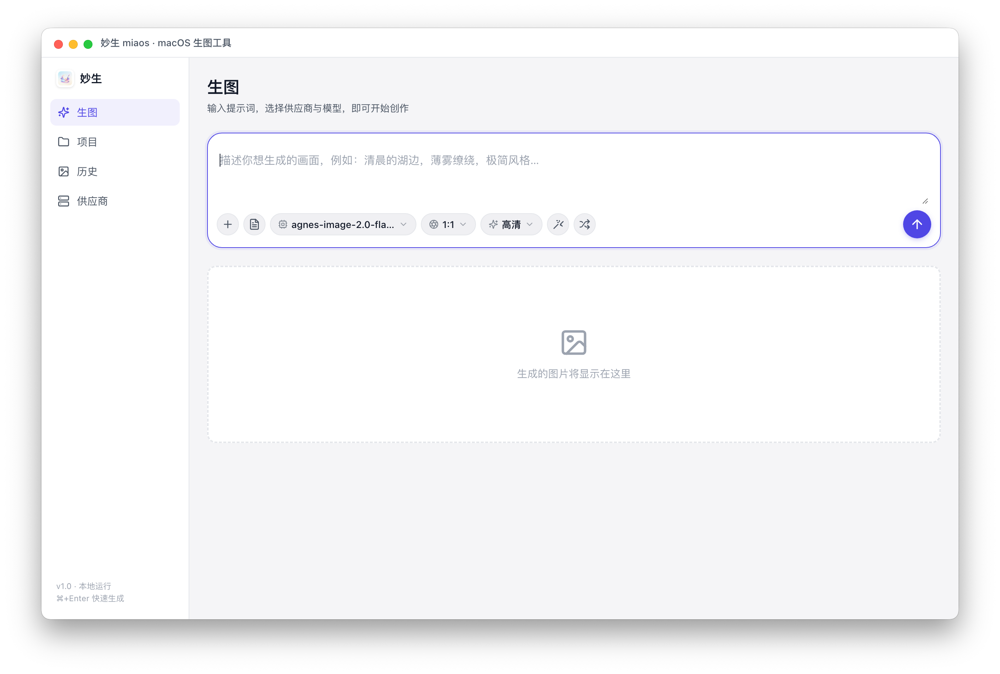
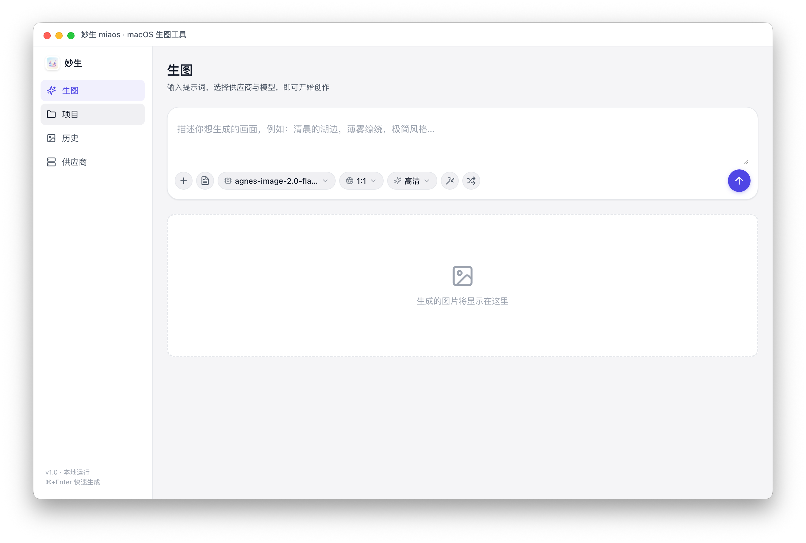
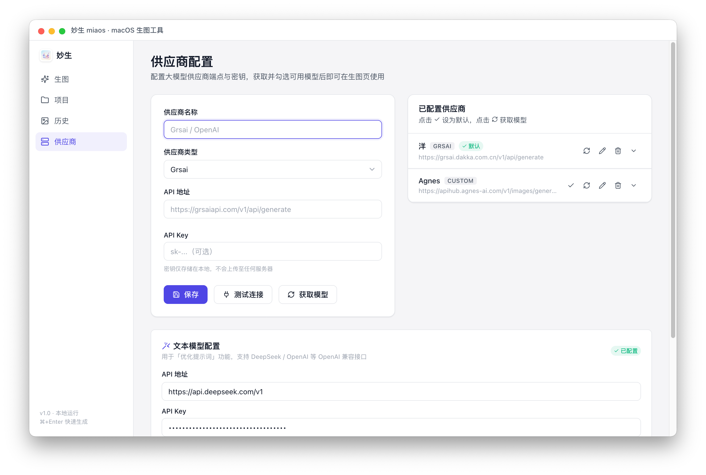
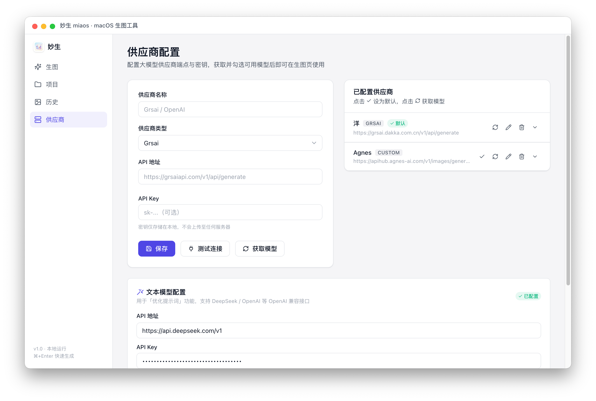

# 妙生 miaos

> macOS 本地生图工具 · 基于 Electron · 支持 Grsai / OpenAI 兼容供应商

妙生是一款专注 macOS 平台的本地生图工具，集成多家大模型供应商，提供项目化的版本树管理与图生图迭代能力。所有配置与生成记录保存在本地，隐私可控。

## 功能特性

- **多供应商接入**：内置 Grsai（gpt-image-2 / nano-banana 系列），兼容 OpenAI Images API 格式
- **项目版本树**：横向时间轴布局，主线节点按创建时间排列，支持多级分支派生
- **图生图迭代**：基于父版本图像派生子版本，递归衍生多级创作链
- **提示词优化**：接入文本模型 chat 接口，一键优化中英文提示词
- **任务队列**：全局串行执行，避免供应商限流，切换页面不丢失进度
- **历史记录**：自动归档每次生成结果，支持搜索与详情查看
- **本地优先**：所有数据存储在 `~/.miaos/`，不上传任何用户信息
- **离线可用**：图标与依赖全部内联，无 CDN 依赖

## 界面预览

### 生图

输入提示词，选择模型、比例与质量，一键生成。支持上传参考图（图生图）、长文本提示词导入与随机示例。



### 项目

为同一主题持续创作，每个项目维护独立的版本树，记录每次提示词与模型的演进。



### 历史记录

所有快速生图的结果按时间倒序归档，支持搜索提示词与一键清空。



### 供应商配置

配置供应商端点与 API Key，自动获取可用模型列表，勾选启用后即可在生图页使用。



## 快速开始

### 环境要求

- macOS 12+（Apple Silicon / Intel）
- Node.js 18+
- npm 9+

### 开发运行

```bash
# 安装依赖
npm install

# 启动开发模式
npm start
```

### 配置供应商

首次启动后，进入「供应商」页面：

1. 内置 Grsai 供应商已预填端点 `https://grsaiapi.com/v1/api/generate`
2. 填入你的 API Key（前往 https://grsai.ai/zh/dashboard/api-keys 获取）
3. 点击「测试连接」验证
4. 点击「获取模型」拉取可用模型列表，勾选需要启用的模型

如需使用 OpenAI 兼容供应商（如自建中转、第三方服务），新增供应商时选择类型「OpenAI 兼容」，填入 `/v1/images/generations` 端点即可。

### 开始生图

- **快速生图**：在「生图」页输入提示词，选择模型与比例，点击发送按钮（或 `⌘+Enter`）
- **项目创作**：在「项目」页新建项目，进入后可基于同一提示词持续出图；修改提示词或模型会自动创建新主线节点
- **分支派生**：点击版本下的图片的「派生分支」按钮，基于该图进行图生图迭代

## 打包构建

```bash
# 构建 .app + 签名
npm run build:dir

# 构建 DMG 安装包（含自动安装脚本）
npm run dist

# 构建 zip 分发包
npm run dist:zip
```

DMG 构建产物位于 `release/` 目录，双击挂载后运行「安装妙生.command」脚本即可自动安装到 `/Applications` 并解除 macOS 安全限制。

## 技术栈

| 层级 | 技术 |
|------|------|
| 框架 | Electron 31 |
| 主进程 | Node.js（HTTPS / fs / IPC） |
| 渲染层 | 原生 ES Modules + CSS（无前端框架） |
| 路由 | Hash 路由（自实现） |
| 图标 | 内联 Lucide SVG |
| 打包 | electron-builder + 自定义 DMG 脚本 |
| 签名 | ad-hoc 签名（codesign） |

## 项目结构

```
.
├── main.js              # 主进程：IPC、生图、文件操作
├── preload.js           # 预加载脚本：暴露安全 API
├── src/
│   ├── index.html       # 应用入口
│   ├── css/             # 主题、外壳、页面样式
│   └── js/
│       ├── renderer.js  # 渲染入口
│       ├── router.js    # Hash 路由
│       ├── store.js     # 状态管理 + localStorage 持久化
│       ├── queue.js     # 全局任务队列
│       ├── icons.js     # 内联 SVG 图标
│       ├── ui.js        # toast / DOM 工具
│       └── pages/       # 各页面模块
│           ├── generate.js   # 生图页
│           ├── projects.js   # 项目列表页
│           ├── project.js    # 项目详情页（版本树）
│           ├── history.js    # 历史记录页
│           ├── models.js     # 供应商配置页
│           └── detail.js     # 图片详情页
├── build/               # 图标资源与安装脚本
├── scripts/             # 构建与签名脚本
└── docs/                # API 文档与截图
```

## 数据存储

所有用户数据保存在本地 `~/.miaos/` 目录：

| 路径 | 内容 |
|------|------|
| `~/.miaos/miaos.state.json` | 应用状态（供应商配置、项目、历史） |
| `~/.miaos/generated/` | 生成的图片文件 |
| `~/Library/Application Support/miaos/` | Electron 运行时数据（缓存等） |

API Key 存储在 localStorage 中，仅本地访问，不会上传到任何服务器。

## 许可证

[MIT](LICENSE)
